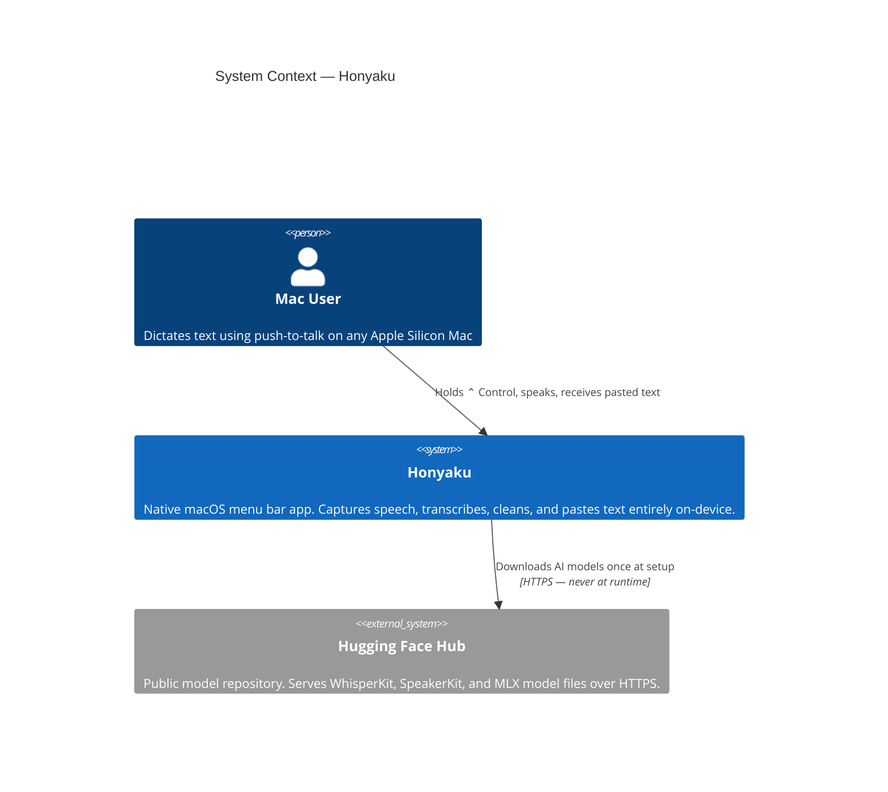
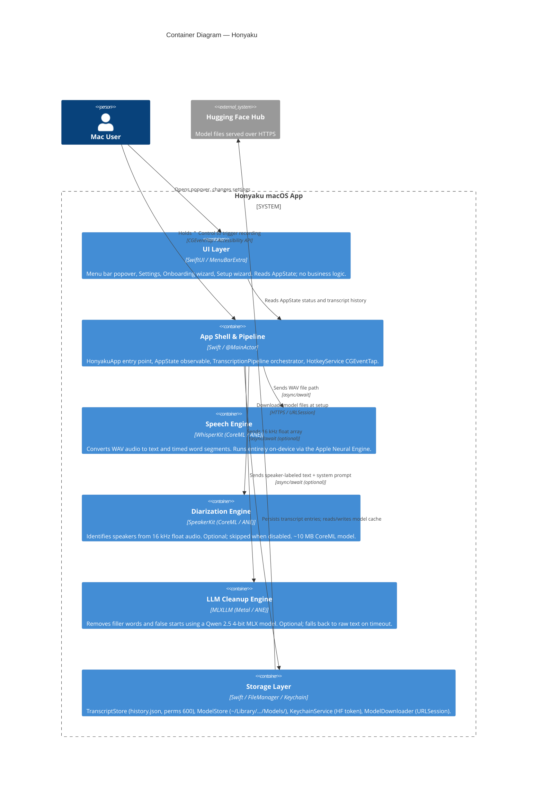
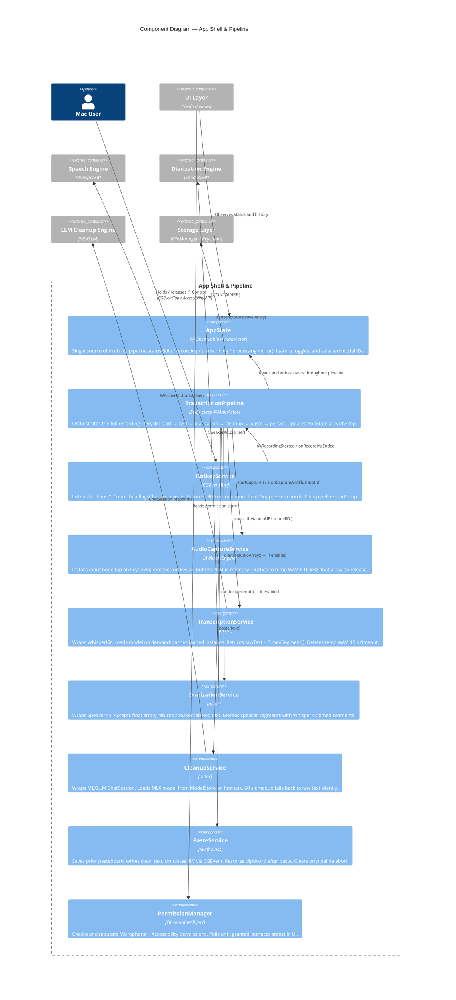

## Context

Honyaku is a greenfield native macOS application. There is no existing codebase to migrate from. The design must satisfy a hard constraint: **all model inference runs on the local machine**; no audio, transcript text, or usage data is transmitted to any remote service after the initial model download.

Ghost Pepper (github.com/matthartman/ghost-pepper) is a close spiritual predecessor — same push-to-talk mechanic, same WhisperKit + LLM.swift stack — and serves as a useful reference implementation. Honyaku extends that model with multi-speaker diarization and a richer model-selection experience.

Target platform: macOS 14.0+, Apple Silicon (M1+).

---

## Goals / Non-Goals

**Goals:**
- Native SwiftUI menu bar app with zero Dock presence
- Push-to-talk via global Control key hotkey using Accessibility API
- Local ASR via WhisperKit (Whisper family models served from Hugging Face)
- Local LLM cleanup via MLXLLM (Qwen 2.5 MLX 4-bit models)
- Speaker diarization via pyannote-audio models (bundled or CoreML-converted)
- First-run setup wizard for model selection and permission onboarding
- All transcript history and recordings stored locally only
- No analytics, no telemetry, no cloud callbacks

**Non-Goals:**
- Intel Mac support (WhisperKit requires Apple Silicon Neural Engine / Metal)
- Real-time word-by-word streaming transcription (batch-on-release model only)
- Cloud-hosted model inference or hybrid cloud/local fallback
- Windows / Linux support
- Mobile (iOS / iPadOS)

---

## Decisions

### D1 — ASR: WhisperKit over faster-whisper or whisper.cpp

**Chosen**: WhisperKit (Swift, CoreML, Metal)

WhisperKit is a first-class Swift package optimised for Apple Silicon via CoreML and the ANE. It eliminates the need for a Python runtime for the ASR path, gives native Swift integration, and is what ghost-pepper ships in production.

*Alternatives considered:*
- `whisper.cpp` — C++ with Swift bindings possible, but less idiomatic and no ANE acceleration
- `faster-whisper` (Python/CTranslate2) — requires bundled Python, higher memory overhead
- `mlx-whisper` — MLX is Apple-native but requires a heavier setup; WhisperKit has a larger community and proven app distribution story

---

### D2 — LLM Cleanup: MLXLLM (ml-explore/mlx-swift-lm) over LLM.swift or llama.cpp

**Chosen**: MLXLLM / MLXLMCommon (ml-explore/mlx-swift-lm v2.30.6, Swift, Metal/ANE, safetensors)

MLXLLM loads MLX-format safetensors models directly in Swift with Metal/ANE acceleration. It ships as a clean SPM package with no external framework or xcframework required, eliminating code-signing issues. Models are downloaded as a directory of safetensors files from mlx-community on Hugging Face. The `ChatSession` API provides a simple synchronous-style interface for single-turn cleanup passes.

*Alternatives considered:*
- `LLM.swift` (GGUF/llama.cpp wrapper) — originally chosen; rejected due to xcframework code-signing failures, `package` access-level build errors, and llama.framework symlink corruption on macOS. The precompiled xcframework required manual reconstruction to pass Gatekeeper.
- `llama.cpp` Swift bindings — same signing and build complexity as LLM.swift without the ergonomic wrapper

---

### D3 — Speaker Diarization: WhisperKit SpeakerKit (native Swift/CoreML)

**Chosen**: WhisperKit's SpeakerKit (argmaxinc/WhisperKit, MIT license) — a native Swift SPM package running CoreML models on the Apple Neural Engine. No Python runtime required.

SpeakerKit uses pyannote v4 / community-1 models converted to CoreML fp16, delivering ~15% diarization error rate (matching pyannote state-of-the-art) with only ~10 MB of model weight. It runs at ~122× real-time on M1. Since the app already depends on WhisperKit for ASR, SpeakerKit is a zero-cost additional dependency in the same package.

**Implementation**: Call `SpeakerKit.diarize(audioURL:)` (or equivalent async API) after audio capture. Returns timestamped speaker segments which are used to label cleanup output. Models are auto-downloaded from Hugging Face on first use and cached locally.

**Secondary option if SpeakerKit proves insufficient**: FluidAudio (FluidInference/FluidAudio, Apache 2.0) — also pure Swift SPM, ~25 MB, ~190× real-time on M4 Pro, supports streaming mode. Requires macOS 14+ vs SpeakerKit's macOS 13+.

*Alternatives considered and rejected:*
- pyannote-audio (Python sidecar) — requires bundled Python runtime (~100–200 MB), no ANE acceleration, complex sandboxing
- ONNX Runtime + wespeaker + Silero VAD — viable but requires building a custom pipeline; SpeakerKit already ships this as a polished Swift API
- SpeechBrain — Python only, no working CoreML export path
- Resemblyzer — Python, ~20–30% DER, outdated approach
- Sherpa-ONNX — C++/Swift bridge, CPU-only ONNX (no ANE), higher latency

---

### D4 — Audio Capture: CoreAudio AVAudioEngine

**Chosen**: `AVAudioEngine` with `AVAudioInputNode` tap.

Native Swift, no dependencies, handles microphone selection and permission prompting cleanly. Audio is buffered in memory (never written to disk) until the Control key is released, then flushed to a temporary PCM file for WhisperKit ingestion.

---

### D5 — Global Hotkey: CGEventTap via Accessibility API

**Chosen**: `CGEventTap` monitoring `.keyDown` / `.keyUp` for `kVK_Control`.

This is the standard approach for global hotkeys on macOS and what ghost-pepper uses. It requires Accessibility permission and must present a clear onboarding prompt. The event tap only activates while the app is running; it does not persist across restarts without explicit re-registration.

---

### D6 — Transcript Paste: Simulated Keystroke (CGEvent)

**Chosen**: Post a `⌘V` keystroke to the frontmost app after writing the cleaned text to the pasteboard.

Simple, reliable, and the standard approach for menu bar dictation tools. Requires Accessibility permission (same grant as the hotkey tap). The user's prior pasteboard contents are restored after paste.

---

### D7 — Model Storage: Application Support directory

Models live at `~/Library/Application Support/Honyaku/Models/<type>/<model-id>/`. Downloads are handled by `URLSession` with progress reporting. WhisperKit models are fetched from the `argmaxinc/whisperkit-coreml` Hugging Face repo; LLM models from their respective HF repos; pyannote models from `pyannote/` HF namespace.

**After first run, no network connection is required.** The app checks for model files at startup and disables the relevant feature with a Settings prompt if files are missing.

---

### D8 — App Architecture: SwiftUI + Observation framework, MVVM

A single `AppDelegate`-free entry point using `@main`. The menu bar extra is driven by a `MenuBarExtra` scene (macOS 13+). Business logic lives in `@Observable` service classes injected via the environment. No third-party UI framework.

---

## Architecture Diagram

### Recording pipeline (happy path)

```
 User holds ⌃ Control
        │
        ▼
┌───────────────────┐
│   HotkeyService   │  CGEventTap on .flagsChanged
│  (CGEventTap)     │  Filters bare Control; ignores chords (⌃⌘, ⌃⇧…)
└────────┬──────────┘  300 ms minimum hold enforced
         │ onRecordingStarted / onRecordingEnded
         ▼
┌───────────────────────────────────────────┐
│          TranscriptionPipeline            │  @MainActor orchestrator
│                                           │  Updates AppState.status throughout
└──┬───────────────────────────────────────┘
   │
   │  1. start capture
   ▼
┌───────────────────┐
│ AudioCaptureService│  AVAudioEngine + AVAudioInputNode tap
│  (AVAudioEngine)  │  Buffers PCM in memory; mic held only while recording
└────────┬──────────┘
         │ WAV file + mono 16 kHz float array (on key release)
         ▼
┌───────────────────┐
│TranscriptionService│  WhisperKit (CoreML / ANE)
│   (WhisperKit)    │  Returns rawText + timed segments; deletes WAV on return
└────────┬──────────┘
         │ rawText + TimedSegment[]
         ▼
┌───────────────────┐
│DiarizationService │  SpeakerKit (CoreML) — skipped when disabled
│  (SpeakerKit)     │  Input: float array; Output: [Speaker N]-labeled text
└────────┬──────────┘  No-op if only 1 speaker detected
         │ labeled text
         ▼
┌───────────────────┐
│  CleanupService   │  MLXLLM (ml-explore/mlx-swift-lm) — skipped when disabled
│   (MLXLLM)        │  Removes fillers/false-starts; preserves [Speaker N] tokens
└────────┬──────────┘  60 s timeout; falls back to labeled text on error
         │ clean text
         ▼
┌───────────────────┐
│   PasteService    │  Writes to NSPasteboard → simulates ⌘V via CGEvent
│ (NSPasteboard)    │  Restores prior clipboard after paste
└────────┬──────────┘
         │
         ▼
┌───────────────────┐
│  TranscriptStore  │  Appends entry to history.json (perms 600, no backup)
└───────────────────┘
```

### Component overview

```
┌─────────────────────────────────────────────────────────────────┐
│                    HonyakuApp  (@main SwiftUI App)               │
│                                                                  │
│  ┌──────────────────────────────────────────────────────────┐   │
│  │  MenuBarExtra  (.window style)                           │   │
│  │  ┌────────────────────┐   ┌───────────────────────────┐ │   │
│  │  │  MenuBarPopoverView│   │      SettingsView          │ │   │
│  │  │  • Status header   │   │  • Models (download/switch)│ │   │
│  │  │  • History list    │   │  • Audio device picker     │ │   │
│  │  │  • Settings button │   │  • Cleanup toggle + prompt │ │   │
│  │  └────────────────────┘   │  • Diarization toggle      │ │   │
│  │                           │  • History / Privacy       │ │   │
│  │  ┌────────────────────┐   └───────────────────────────┘ │   │
│  │  │   OnboardingView   │   ┌───────────────────────────┐ │   │
│  │  │  Mic + Accessibility│  │     SetupWizardView        │ │   │
│  │  │  permission steps  │   │  Model picker → download   │ │   │
│  │  └────────────────────┘   └───────────────────────────┘ │   │
│  └──────────────────────────────────────────────────────────┘   │
│                                                                  │
│  ┌──────────────┐   ┌──────────────────────────────────────┐   │
│  │   AppState   │   │        TranscriptionPipeline          │   │
│  │ @Observable  │◀──│  Wires HotkeyService → pipeline steps │   │
│  │ @MainActor   │   └──────────────────────────────────────┘   │
│  └──────────────┘                                               │
└─────────────────────────────────────────────────────────────────┘

Storage layer
┌─────────────────┬──────────────────────────────────────────────┐
│ TranscriptStore │ ~/Library/Application Support/Honyaku/        │
│                 │   history.json  (JSON, perms 600, no backup)  │
├─────────────────┼──────────────────────────────────────────────┤
│ ModelStore      │ ~/Library/Application Support/Honyaku/Models/ │
│ ModelDownloader │   <type>/<model-id>/ — safetensors + configs  │
│                 │   Downloaded via URLSession + HF API          │
├─────────────────┼──────────────────────────────────────────────┤
│ KeychainService │ macOS Keychain — HF access token only         │
│                 │   Never used at runtime inference             │
└─────────────────┴──────────────────────────────────────────────┘

Network policy
  Download only  ──▶  huggingface.co  (model files + HF repo API)
  Never          ──▶  audio, transcripts, speaker data, telemetry
```

---

## C4 Diagrams

### Level 1 — System Context



---

### Level 2 — Containers



---

### Level 3 — Components (App Shell & Pipeline)



---

## Risks / Trade-offs

| Risk | Mitigation |
|---|---|
| Python sidecar increases binary size and startup time | Diarization is opt-in; Python runtime only initialised when feature is enabled |
| pyannote models require HF access token on first download | Document clearly in setup wizard; token stored in Keychain, never transmitted at runtime |
| Accessibility permission denial breaks hotkey and paste | Graceful fallback: show status popover with instructions; app remains functional for manual copy |
| WhisperKit memory spikes on large models (>1 GB) | Expose model tier selector prominently; default to `small.en` (~466 MB); warn users before downloading large models |
| MLX model format changes across mlx-swift-lm versions | Pin to a stable release (v2.30.6); test cleanup models after any SPM update |
| App notarisation / Gatekeeper warnings | Sign and notarise via standard Apple Developer Program flow; document "Open Anyway" steps in README |

---

## Migration Plan

This is a new application — no migration from an existing system. Deployment steps:

1. Build release binary with Xcode (Archive → Distribute)
2. Sign with Developer ID Application certificate
3. Notarise via `notarytool`
4. Package as DMG with drag-to-Applications install
5. Distribute via GitHub Releases (no App Store initially; Accessibility entitlement complicates sandbox review)

Rollback: users can delete the app and `~/Library/Application Support/Honyaku/`; no system state is modified beyond the Accessibility permission grant.

---

## Open Questions

1. **pyannote HF token UX**: The `community-1` pipeline requires a HF access token accepted once. Should we bundle the token acceptance flow in the first-run wizard, or prompt lazily when diarization is first enabled?
2. **CoreML diarization timeline**: Is a CoreML-native diarization path a v1 goal or a post-launch optimisation? (Recommendation: post-launch; ship Python sidecar for v1.)
3. **Multilingual support scope for v1**: Should the model selection wizard surface multilingual Whisper variants, or English-only to reduce support surface?
4. **Transcript history retention policy**: Should there be a configurable auto-purge (e.g., 30-day rolling window), or leave it entirely to the user?
